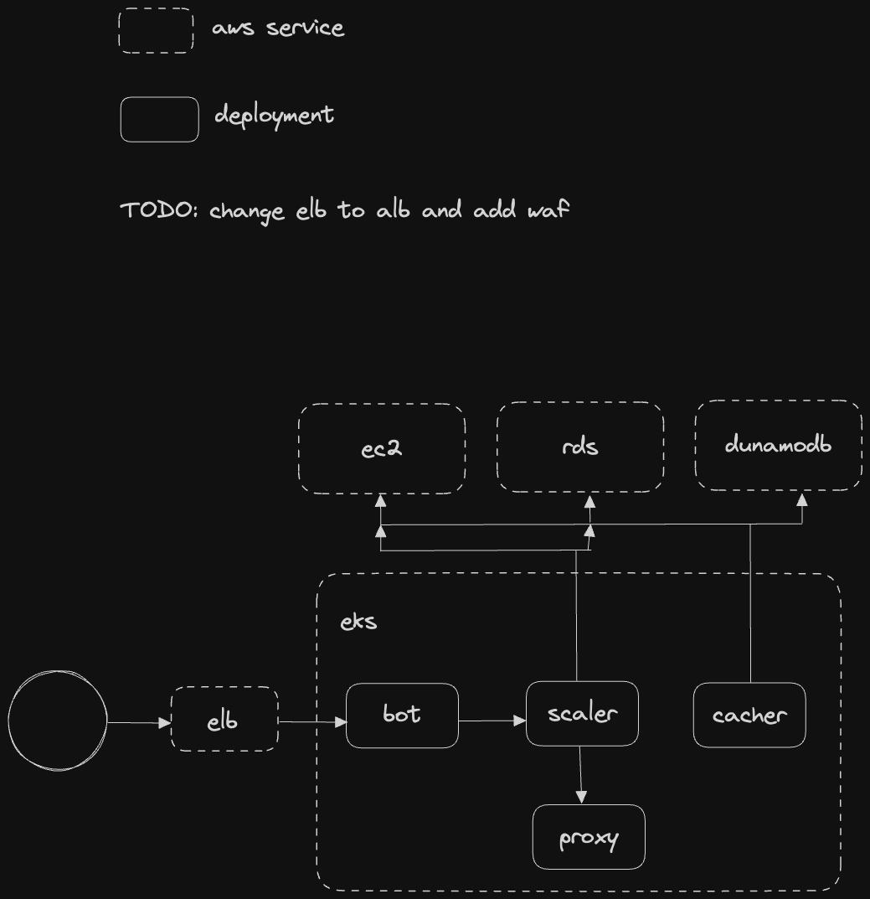

# Kubernetes deployments and stateful sets scaler via slack bot slash command

## diagram




Kubernetes cluster with multiple namespaces. These namespaces should be stopped at specific time every working day and started manually by user request.

## requirements

Namespace should be stopped by `cronjob` at specific time if it has `scheduler=enabled` label. All namespaces should have the same scheduled shutdown time (for now it's hardcoded in template and can be found in `src/templates/cronjob.py`).

cronjob is created automatically and should be active when:
* we create a new namespace without label
* we label a namespace with `scheduler=enabled`

cronjob should be paused when:
* namespace has been created with `scheduler=disabled`
* namespace has been relabeled with `scheduler=disabled`

Additional cronjob should reset shutdown time in all namespaces to default one every morning.

`CREATE` and `UPDATE` kubernetes events on namespace should be managed by `AdmissionWebHook`. (see app-scaler/controllers/cronjob_controller.py`).

### additional requirements

EC2 or RDS instances should be stopped or started if they have the same labels. For instance,

```yaml
namespace: dev1
scheduler: enabled
```

We should have a possibility to run `static` pod for management purpose. Request should consist of memory size of a pod (like XS,S,M etc).

There should be at least 3 types of notifications before environment is going to shutdown: 1 hour before, 30 and 15 mins before shutdown.


## slack slash commands

Commands should send default payload to scaler api; that means it will scale all deployments and stateful sets to 0 replicas as stop/start commands.

### prolongate

Namespace can be prolongated: user can modify (add hours) shutdown time by invoking command /<slash-command> prolongate <namespace> for <hours>. Example:

```yaml
/devenv prolongate dev1 for 1h
```

### start

Namespace can be started manually by user request by invoking command /<slash-command> start <namespace>. Example:

```yaml
/devenv start dev1
```

### stop

Namespace can be stopped manually by user request by invoking command /<slash-command> stop <namespace>. Example:

```yaml
/devenv stop dev1
```

### status

We can track actual status of specific deployment (based on kubernetes deployment status) via /<slash-command> status <namespace>. Example:

```yaml
/devenv status dev1
```

### help

Slash command should have help command which will return actual help message for all commands via /<slash-command> help. Example:

```yaml
/devenv help
```

### suppoer

Slack command to start and stop manage pod. /<slash-command> support start <name> <size>

```yaml
/devenv support start manage1 XL
/devenv support stop manage1
```


## scaler api

OpenAPI scheme is on `/docs` url.

## cacher

Purpose is to save ec2 and rds instances with provided labels into dynamodb as cache location. Written in `Golang`.

## proxy

A proxy for scaler service because AdmissionWebhook needs a ssl endpoint.


